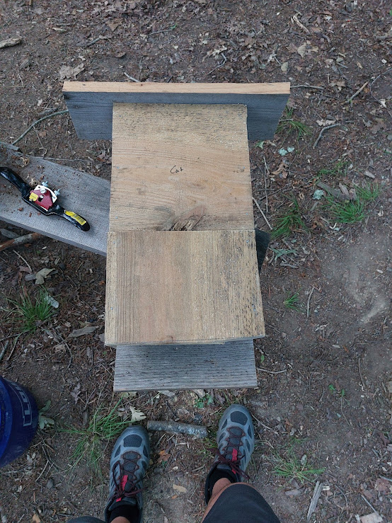
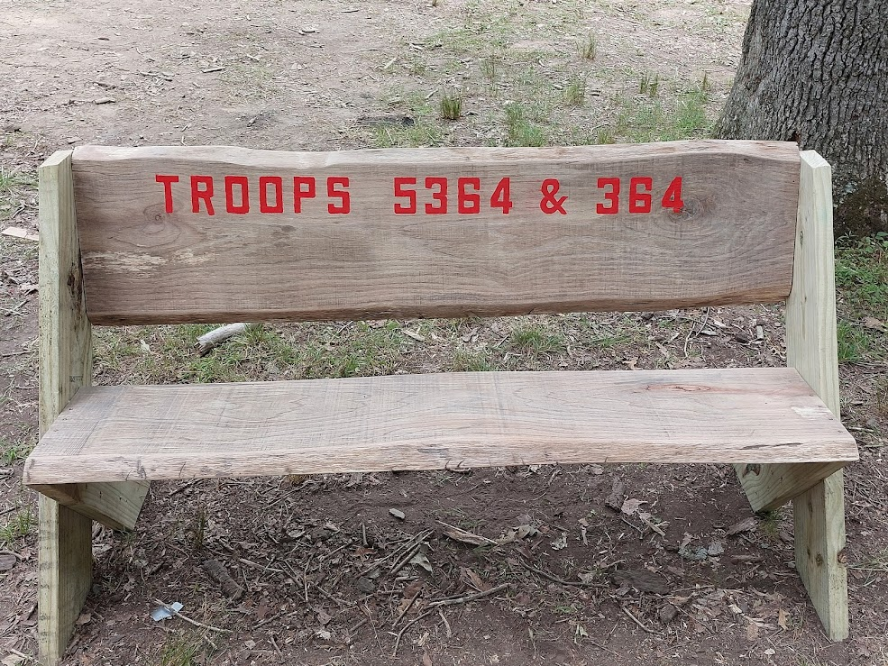
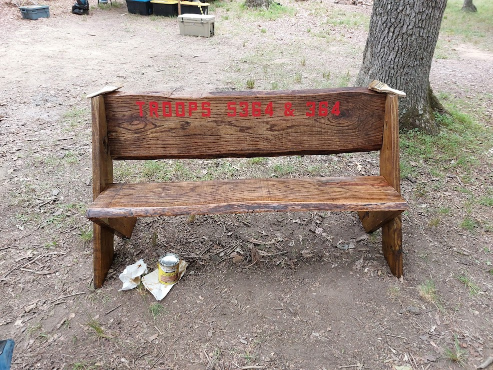
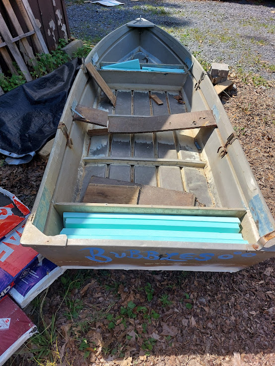
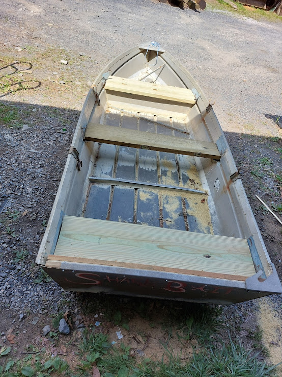
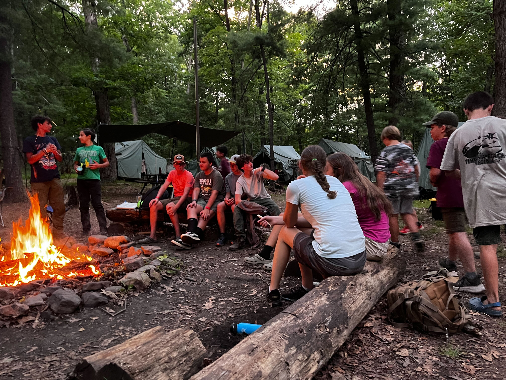
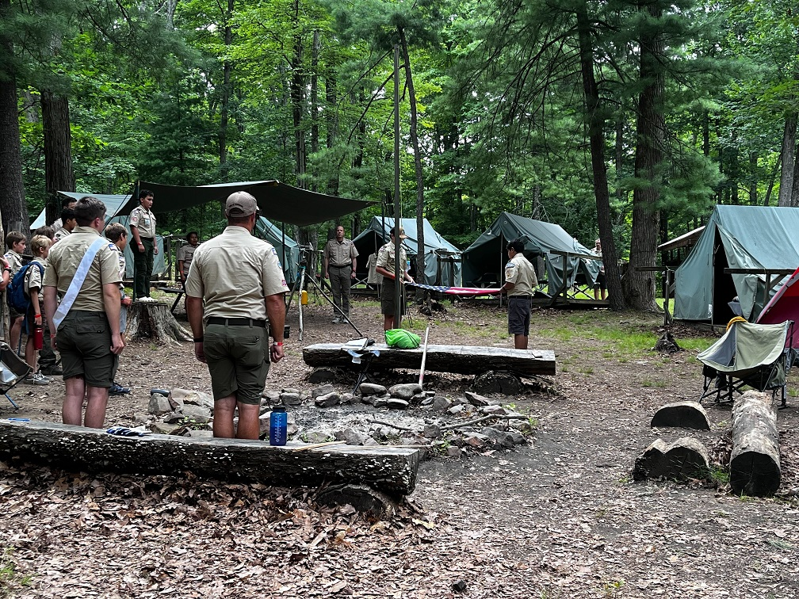
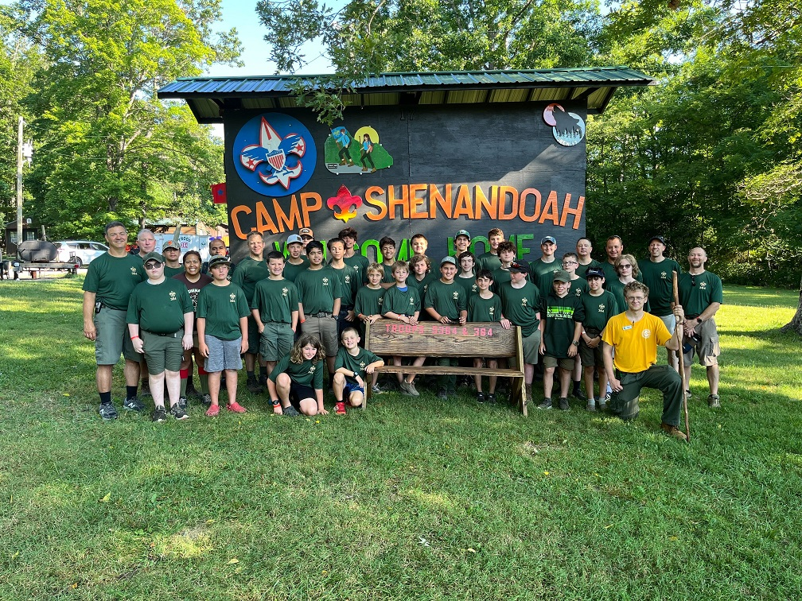
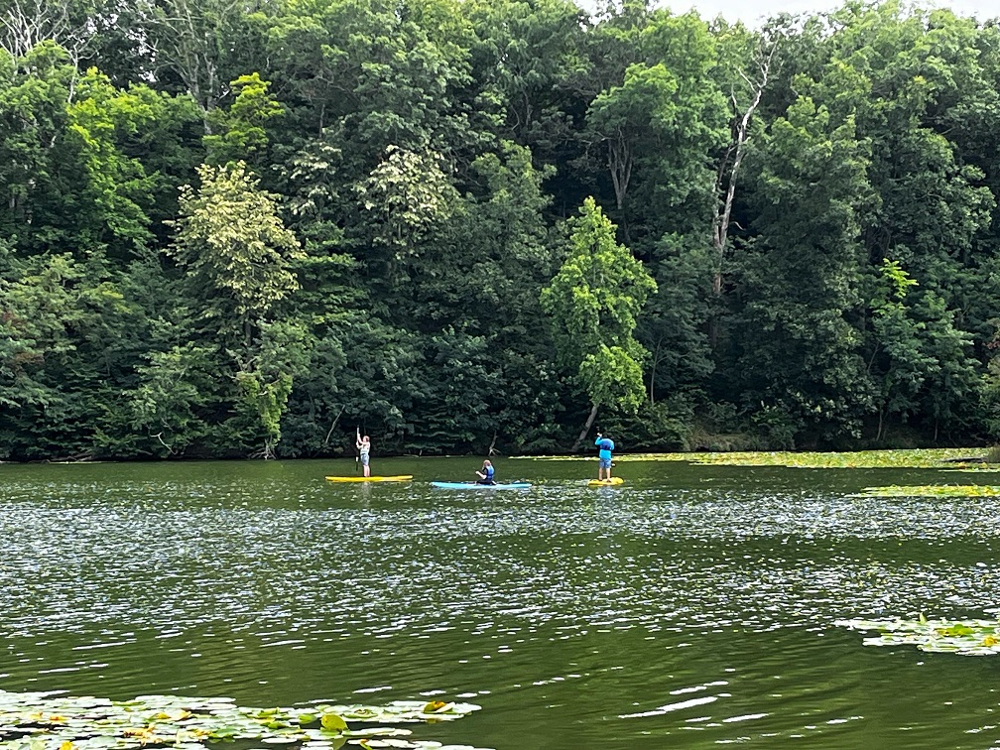
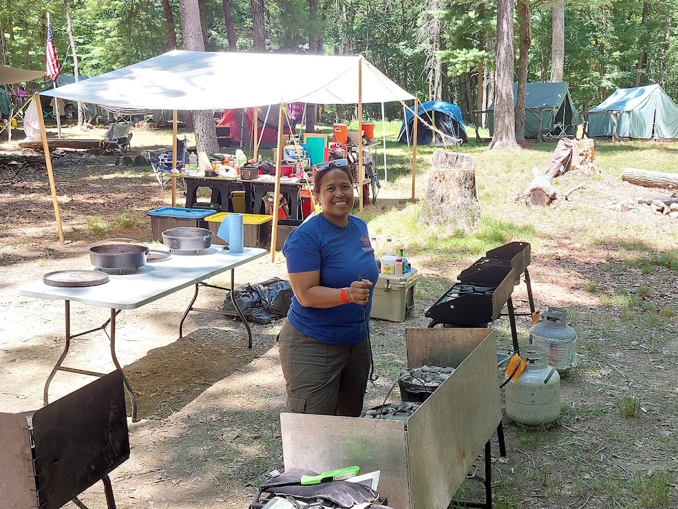

# July Outing — Summer Camp 2024

## Trip Details

**Who:** Troop 364 & Troop 5364
**What:** Summer Camp 2024
**Where:** Camp Shenandoah, Swoope, Virginia
**When:** July 7–13, 2024
**Why:** Have fun and enjoy the outdoors, learn new skills, earn merit badges, get rank/book sign-offs, and hold boards of review for rank advancement.

---

## :material-weather-partly-cloudy: Weather

Rain was often forecast, but it never came.

- **Sunday–Tuesday:** Hot! Temperatures around **95°F**.
- **Wednesday–Friday:** Nicer — around **85°F** with some clouds.
- Overall it was a **dry** year. Even one of the streams had dried up.

!!! tip "Beat the Heat: Misting System"
    We set up a misting system to help with the heat — we do this every year. The pressure regulator prevents the nozzles from shooting out of the line.

    **Parts list:**

    - [Mister nozzles](https://www.amazon.com/dp/B0922PCQSG?ref=ppx_yo2ov_dt_b_product_details&th=1)
    - [Water line pressure regulator](https://www.homedepot.com/p/Rain-Bird-Drip-25-psi-Pressure-Regulator-for-3-4-in-FHT-x-3-4-in-MHT-HT07525PSX/202262484)
    - [1/4" water line](https://www.homedepot.com/p/Rain-Bird-1-4-in-x-100-ft-Distribution-Tubing-for-Drip-Irrigation-T22-100SX/202078362)
    - [Water outlet splitter](https://www.homedepot.com/p/Morvat-Brass-Garden-Hose-Splitter-Heavy-Duty-2-Way-Hose-Connector-Fitting-MOR-BCONNECTOR-2-A/316286197)
    - [Hose adapter — garden hose to 1/4"](https://www.homedepot.com/p/Everbilt-3-4-in-FHT-x-1-4-in-O-D-Compression-Brass-Adapter-Fitting-801789/207176917)

!!! warning "Yellow Jackets"
    Because it was so dry, yellow jackets were attracted to the misters and the water on the ground. There was one nest close to camp that was dug up and removed.

---

## :material-trophy: Awards & Achievements

- :star: **Troop 5364 won Honor Troop** for the entire camp!
- ~10 adults earned **IOLS** (Introduction to Outdoor Leader Skills)
- **125+ merit badges** earned
- ~5 **Aquatics Certifications**
- Mile Swim completions

---

## :material-hammer-wrench: Camp Service Projects

Troop 364 and 5364 completed several service projects for Camp Shenandoah:

| Project | Details |
|---------|---------|
| **Bat House** | Troop 364 built and donated a bat house to the Nature area |
| **Bench** | Both troops built and donated a bench (now in front of the Medical area) |
| **Boat Repair** | Repair work on row boats |

{ width="200" }

{ width="350" }

{ width="350" }

{ width="200" }

{ width="200" }

[:material-link: Bench Plans](https://rogueengineer.com/diy-outdoor-bench-plans-with-back/)

---

## :material-bird: Wildlife Observed

| Animal | Notes |
|--------|-------|
| Deer | Fawns and does spotted around camp |
| Owl | Heard at night |
| Cardinals | Seen throughout camp |
| Turtle Dove | |
| Squirrel | Common around camp sites |
| Raccoon | Nighttime visitors |
| Black Rat Snake | Non-venomous — good for pest control! |
| Timber Rattler | Rumored sighting |
| Blue-tailed Skink | |
| Mice | Around camp |
| Bass | In the lake |

---

## :material-tree: Plants & Trees Identified

- White Oak
- Hickory
- PawPaw
- Pine
- Dogwood
- Tulip Poplar
- Blackberry

---

## :material-mushroom: Mushrooms & Fungi

It was a dry year, so fungi were less abundant than usual.

| Mushroom | Notes |
|----------|-------|
| White Amanita (probably *Amanita cokeri*) | Lots of these |
| Jack O'Lantern (*Omphalotus olearius*) | Found a patch — **poisonous, do not eat!** |
| Red Russula | A few spotted |
| Milk Caps | A few spotted |
| Chicken of the Woods | One older, small specimen |
| Puffballs | |

---

## :material-pot-steam: Food & Cooking

### Dutch Oven No-Knead Bread (from IOLS Training)

A great recipe the adults made during their IOLS training:

| Ingredient | Amount |
|------------|--------|
| Warm water | 1½ cups |
| Yeast | 1 packet |
| Salt | ½ tablespoon |
| Flour | 3¼ cups |
| Parchment paper | as needed |

**Instructions:**

1. Mix all ingredients in a bowl
2. Place dough ball in a different bowl lined with parchment paper
3. Let rise for 1–3 hours (depending on outside temperature) until doubled in size
4. Preheat dutch oven to **400°F**
5. Place parchment paper and dough ball in the dutch oven
6. Cook for about **30 minutes**

---

## :material-tent: Gear Report

### Gear We're Glad We Brought
- Misting system (essential in 95°F heat!)
- 4-way water splitter

### Gear We Wish We Had Brought
- Thinner wood for bat house (only need ½" wood)
- Pre-cut bench parts (to avoid doing heavy work in the heat)

---

## :material-lightbulb: Lessons Learned

1. **Water pressure regulators matter** — Adding an extra pressure regulator to a spigot (without a hose) prevents water from splattering everywhere. (Thanks Billy for the 4-line splitter!)
2. **Do bench prep work before camp** — Everyone was busy and it was hot. Pre-cut and pre-drill at home.
3. **Stencil lettering tip** — Paint bleeds through stencils and sticks when dried. Instead, use a marker to trace the letters, remove the stencils, *then* paint.
4. **Bat house wood thickness** — We only need ½" wood. Thinner boards work better.
5. **Dry conditions attract pests** — Yellow jackets will swarm any water source when it's dry.

---

## :material-camera: Photos

{ width="300" }

{ width="300" }

{ width="300" }

{ width="300" }

{ width="300" }

{ width="300" }

