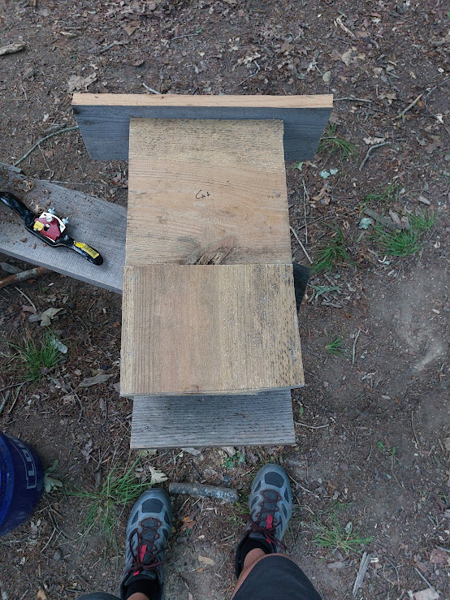
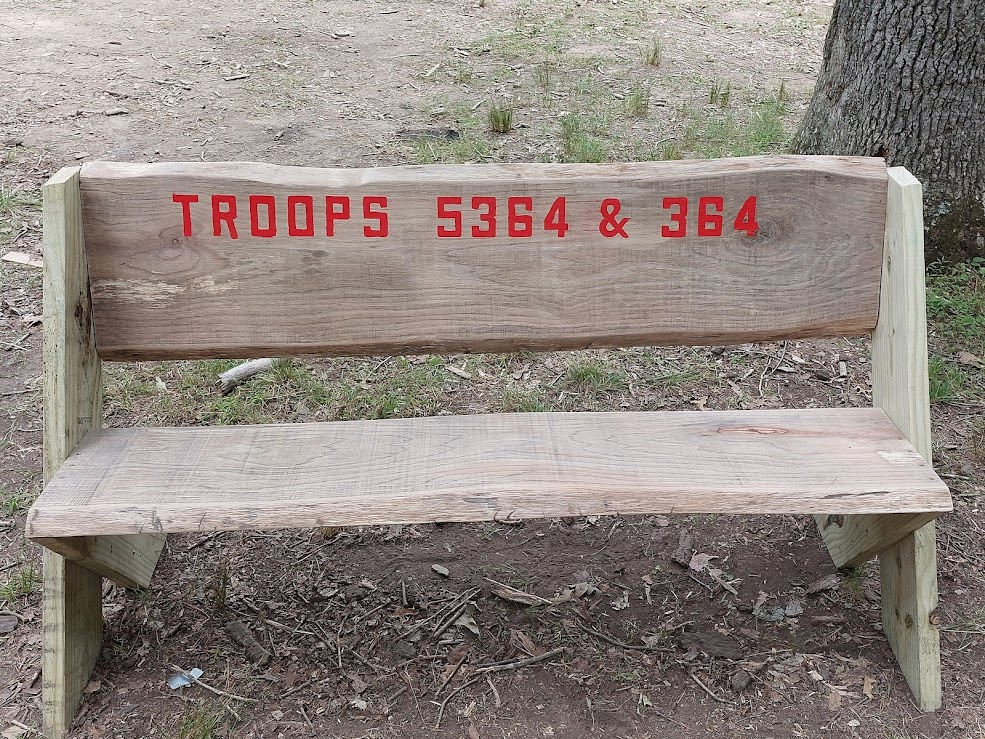
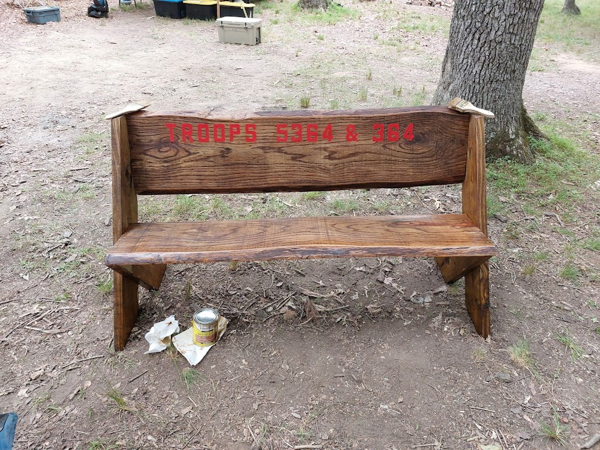

# Summer Camp 2024
- Who: Troops 5364 and 364
- What: Summer Camp 2024 
- Where: Camp Shenandoah, Swoop Virginia 
- When: 2024-07-07 to 2024-07-13
- Why: Have fun and enjoy the outdoors, learn new skills, earn meritbadges, get rank/book signoffs, have board of reviews for rank advancement.

## Weather

Rain was often forcasted, but it never came.\
Sunday, Monday, Tuesday were hot! Temperatures around 95 degrees.\
Wednesday, Thursday, and Friday weather was nicer around 85 degrees with some clouds.\

We setup a misting system to help with the heat. We do this every year.\
The pressure regulator or the nozzles may shoot right out of the line from too much pressure.\
[Mister nozzles](https://www.amazon.com/dp/B0922PCQSG?ref=ppx_yo2ov_dt_b_product_details&th=1)\
[Water line Pressure regulator](https://www.homedepot.com/p/Rain-Bird-Drip-25-psi-Pressure-Regulator-for-3-4-in-FHT-x-3-4-in-MHT-HT07525PSX/202262484)\
[1/4 water line](https://www.homedepot.com/p/Rain-Bird-1-4-in-x-100-ft-Distribution-Tubing-for-Drip-Irrigation-T22-100SX/202078362)\
[Water outlet splitter](https://www.homedepot.com/p/Morvat-Brass-Garden-Hose-Splitter-Heavy-Duty-2-Way-Hose-Connector-Fitting-MOR-BCONNECTOR-2-A/316286197)\
[Hose adapter - garden hose to 1/4 inch](https://www.homedepot.com/p/Everbilt-3-4-in-FHT-x-1-4-in-O-D-Compression-Brass-Adapter-Fitting-801789/207176917)

## Awards 

- Troop 5364 won Honor Troop for the whole camp.
- 10? adults earned IOLS (Intruduction to Outdoor Leader Skills)
- 125 Meritbadges earned
- 5? Aquatics Certifications
- ?? mile swim

## Camp Projects

- Troop 364 built and donated a bat house to the Nature area for woodworking service project.
- Troop 5364 and Troop 364 built and donated a bench currently located out front of the Medical area.\

[Bench Plans](https://rogueengineer.com/diy-outdoor-bench-plans-with-back/)\

## Trees/plants Identified
- White Oak
- Hickory
- PawPaw
- Pine
- Dogwood
- Tulip Poplar
- Blackberry

  
## Animals
- deer - fawns and does
- owl
- turtle dove
- squirrel
- racoon
- black rat snake
- timber rattler (rumored)
- blue tailed skink
- mice
- bass
   
## Lessons Learned 

- Adding an extra water pressure regulator to a water spigot (without a hose) prevents water from splattering all over the place. (We had a 4 line splitter this year. Thanks Billy.)
- Do more bench work before we go to summer camp. This year everyone was busy and it was hot.
- On the bench lettering, the paint bleed through the stencis and stuck when they dried. Using a marker to trace the letters then paint after removing the stencils.
- The bat house wood could have been thinner. We only need half inch wood.
- 

## Random

For IOLS Training we made dutch oven no-kneed bread.

- 1 1/2 cups warm water
- 1 packet yeast
- 1/2 tablespoon salt
- 3 1/4 cups flour
- parchment paper

Mix in a bowl. Place dough ball in a different bowl lined with parchment paper and let rise for 1 to 3 hours depending on temperature outside. When it doubles in size it is ready.\
Preheat dutch oven to 400 degrees\
Cook for about 30 minutes.

