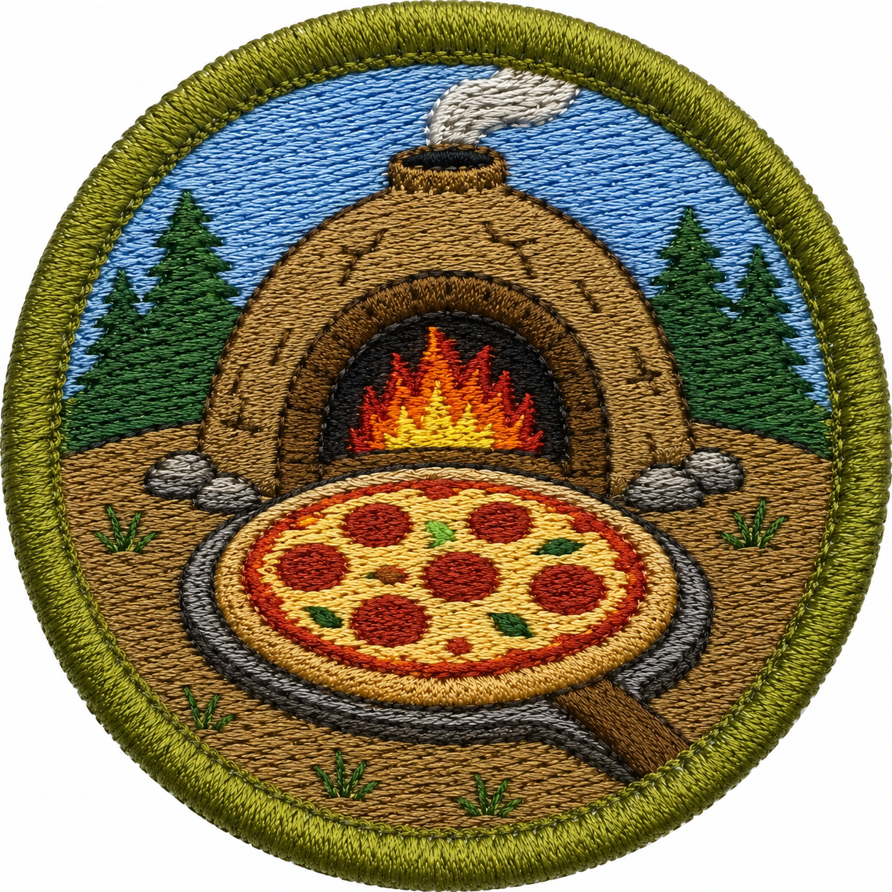
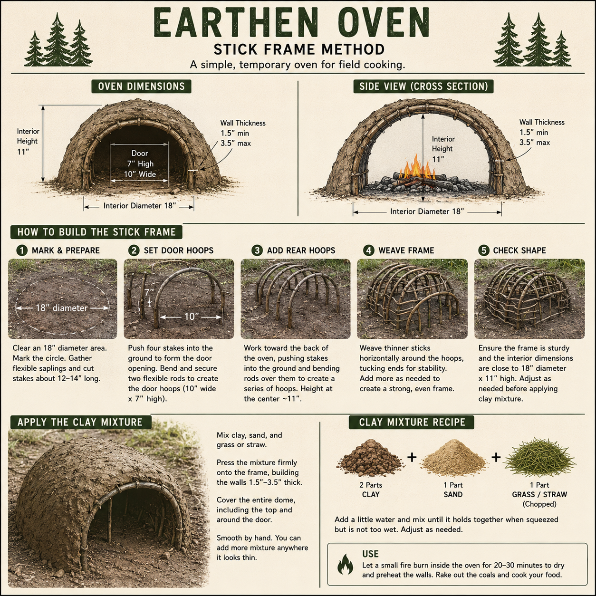

# Pizza Oven Merit Badge

  

    

      <h2>Build it. Fire it. Bake it.</h2>
      

        The Pizza Oven Merit Badge challenges scouts to build a working earthen oven from
        natural materials, prepare dough from scratch, and cook a real wood-fired pizza.
        This badge is unique to our troop and celebrates outdoor cooking, craftsmanship,
        and patience.
      

    

    <figure class="merit-badge-image-wrap">
      
    </figure>
  

  

    

      Theme
      <strong>Outdoor Cooking</strong>
    

    

      Skill Areas
      <strong>Fire Building, Baking, Construction</strong>
    

    

      Final Challenge
      <strong>Cook an 8&quot; pizza in a scout-built oven</strong>
    

  

  

    <h2>Overview</h2>
    

      To earn this badge, a scout must build an earthen oven large enough to cook an 8-inch
      pizza using sandy-clay and straw or grass. After the oven is complete, the scout
      must prepare pizza dough from scratch, heat the oven with firewood, and cook the
      pizza successfully inside the oven they built.
    

  

  

    <h2>Requirements</h2>
    <ol class="merit-badge-list">
      <li>
        Explain how an earthen oven works, including how the oven stores heat and why natural
        materials like clay, sand, and straw or grass are used.
      </li>
      <li>Explain what temperatures and times are needed to successfully cook the pizza.</li>
      <li>
        Explain what the following are and why they must not be used for cooking or in
        cooking fires: treated lumber, painted lumber, plywood, engineered wood.
      </li>
      <li>
        Explain why bread rises and why it makes good pizza dough. Explain how one can tell if the dough has been over-risen.
      </li>
      <li>
        Build an earthen oven that is large enough to cook an 8-inch pizza.
      </li>
      <li>
        Use sandy-clay, straw or grass, and some water as the main building materials for the oven.
        The materials should be sourced from nature and not purchased.
      </li>
      <li>
        Make pizza dough from scratch. See recipe below.
      </li>
      <li>
        Use food-safe firewood to heat the oven until it is ready for cooking.
      </li>
      <li>
        Cook an 8-inch pizza in the oven you built.
      </li>
      <li>
        Write down and share with your merit badge instructor what you would do
        differently to improve the oven or pizza next time.
      </li>
    </ol>
  

  

    

      <h3>Build</h3>
      

        Shape a sturdy oven body from natural materials and make sure the cooking chamber
        is large enough for an 8-inch pizza.
      

    

    

      <h3>Cook</h3>
      

        Heat the oven with firewood, manage the coals safely, and learn how timing and
        temperature affect a wood-fired bake.
      

    

    

      <h3>Create</h3>
      

        Mix dough from scratch and turn simple ingredients into a finished pizza cooked in
        your own handmade oven.
      

    

  

  

    

      <h2>Suggested Materials</h2>
      <ul>
        <li>Clay</li>
        <li>Sand</li>
        <li>Straw or grass for the oven</li>
        <li>grass to lash the snowshoe grill together or use natural untreated hemp twine or cooking twine</li>
        <li>Water</li>
        <li>Firewood</li>
        <li>Pizza peel, flat pan, or safe method for placing pizza in the oven</li>
      </ul>
    

    

      <h2>Safety Notes</h2>
      <ul>
        <li>Use proper fire safety and adult supervision.</li>
        <li>Handle hot surfaces and coals carefully.</li>
        <li>Keep water or other fire-control tools nearby.</li>
        <li>Choose a safe outdoor area for oven building and cooking.</li>
      </ul>
    

  

  

    <h2>Safety Checklist</h2>
    

      Use this checklist to review the main safety points before building or firing the oven.
      Many different woods are not safe for cooking, so when in doubt, do not use it.
    

    <ul>
      <li>Do not use synthetic rope to make the snowshoe grill. Use grass or cooking twine.</li>
      <li>Do not build the oven with stones, especially river stones, because trapped moisture can make them explode when heated.</li>
      <li>Use food-safe, untreated wood for firewood and the pizza platform. Good examples include oak, birch, maple, and cherry.</li>
      <li>Do not use treated, painted, stained, glued, or pressure-treated wood.</li>
      <li>Do not use unknown scrap wood, driftwood, plywood, particleboard, or lumber with chemicals on it.</li>
      <li>Keep the oven away from dead trees, dry roots, brush, and anything else that could catch fire.</li>
      <li>Use adult supervision, fire tools, and water or another fire-control method.
      </li>
      <li>Let the oven and coals cool completely before cleaning or moving anything.
      </li>
    </ul>
  

  

    <h2>Pizza Dough Recipe</h2>

    
This is a simple no-knead dough recipe that works for bread or pizza dough. Feel free to adjust the amount of water, but keep the hydration between 65% and 70%.

    
Mix the ingredients in a very large container with a wooden spoon until mostly combined. Cover and let rise in a warm environment for at least six hours, but up to 24 hours.

    
Roll into 5-ounce balls and place in a covered pan for 30 minutes, longer if it is cold outside.

    
After the dough balls have risen again, they are ready to use in making pizzas.

    <ul>
      <li>1000 grams of flour</li>
      <li>650 to 700 grams of water. (700 grams makes great pizza, but very hard to handle because it is so sticky. Recommend 650 for first time.)</li>
      <li>1 to 2 tablespoons of yeast. 1 tablespoon for slower rising time, 2 for faster rising time.</li>
      <li>1 to 2 tablespoons of salt. (This is a taste preference. Salt is needed to make the dough rise, but 1 tablespoon is enough.)</li>
    </ul>
  

  

    <h2>How to Make the Oven</h2>

    <figure>
      
    </figure>
    
<i>Ignore the recipe in the image. Use what nature provides but do mix in the grass.</i>
     
    <i>Ignore the text to rake out the coals. You want to keep the coals in there.</i>
     

    <a href="https://gearjunkie.com/camping/how-to-make-an-easy-earth-oven" target="_blank">Good Video on how to make the oven</a>
    

      These instructions are for a temporary earthen oven that can be used a few times. Adult
      supervision is required for building, drying, and firing the oven.
    

    <h3>1. Find the right soil</h3>
    

      Look for clay or sandy clay below the topsoil. Topsoil is usually darker and full of
      roots and organic material, so it is not the best base for an oven.
    

    <h3>Understanding the Materials</h3>
    

      Earthen ovens work best when the soil has the right mix of particle sizes and binding
      strength. The standard order from smallest to largest particles is clay, silt, sand,
      then rocks.
    

    
Note: Long-term pizza ovens use 85% silica sand and 15% clay. This can be expensive and is not a goal of this merit badge.

    
In soil science, clay, silt, and sand are particle sizes, not specific material types. There are many kinds of clay, silt, and sand, but generally speaking, clay is sticky when wet and does not burn. Sand does not burn or melt at pizza oven temperatures.

    <table>
      <thead>
        <tr>
          <th>Material</th>
          <th>What It Does</th>
        </tr>
      </thead>
      <tbody>
        <tr>
          <td><strong>Clay</strong></td>
          <td>The finest soil particles. Clay has a high surface area, holds water well, and gives the oven plasticity and cohesion.</td>
        </tr>
        <tr>
          <td><strong>Silt</strong></td>
          <td>Medium-fine particles that feel smooth like flour. Silt can help fill spaces, but too much can make the mix weak and prone to erosion. Real pizza ovens do not use silt.</td>
        </tr>
        <tr>
          <td><strong>Sand</strong></td>
          <td>Coarser mineral grains that add bulk, reduce shrinkage, and help keep the mud from cracking as it dries.</td>
        </tr>
        <tr>
          <td><strong>Rocks</strong></td>
          <td>Large particles that are usually too big for the mud mix. Small gravel can sometimes help drainage, but larger rocks make shaping harder and can create weak points.</td>
        </tr>
      </tbody>
    </table>

    <h3>2. Mix the mud</h3>
    

      Combine clay, sand, water, and straw or dry grass until the mixture is thick
      and packable. It should hold together when squeezed, but not be so wet that it runs.
    

    <h3>3. Build the base and form</h3>
    
Clear an area to build the oven. It should be safe for starting a fire. Do not build near dead trees, because roots can catch fire. Use small sticks to build the scaffolding to hold the mud slabs in place while building the oven. They can be burned out after the dome is completed. Do not use large green firewood; it will not burn out. One strategy is to bundle sticks to make the structure. Another is to bend green sticks into hoop shapes by sticking one end into the ground, bending them, and sticking the other end into the ground, similar to a dome tent.

    
Mixing the mud. Don't overdo it with the water. Use more straw or grass than you expect. The more grass or straw, the better the structure will hold together, but you can overdo it. It must all stick together and still survive being heated up. If there is not enough clay and sand, the straw will burn away.

    
Brick method: form bricks out of the mud and stack them into a dome shape.

    
Slab method: form slabs that can be draped over the scaffolding to form the dome. The slabs must be thick enough to hold the shape after the scaffolding is burned away.

    

      Make a solid base first, then build a dome or tunnel shape that is large enough for
      an 8-inch pizza and a peel or flat pan. A wall thickness of about 2 to 3 inches is a
      good target for a temporary oven.
    

    <table>
      <thead>
        <tr>
          <th>Feature</th>
          <th style="text-align: right;">Recommended Size</th>
        </tr>
      </thead>
      <tbody>
        <tr>
          <td>Interior floor diameter</td>
          <td style="text-align: right;"><strong>16-18 in</strong></td>
        </tr>
        <tr>
          <td>Interior dome height</td>
          <td style="text-align: right;"><strong>10-11 in</strong> (about 63% of floor diameter)</td>
        </tr>
        <tr>
          <td>Door width</td>
          <td style="text-align: right;"><strong>9-10 in</strong></td>
        </tr>
        <tr>
          <td>Door height</td>
          <td style="text-align: right;"><strong>6-7 in</strong> (about 63% of dome height)</td>
        </tr>
        <tr>
          <td>Mud wall thickness</td>
          <td style="text-align: right;"><strong>3-4 in</strong></td>
        </tr>
        <tr>
          <td>Overall outside diameter</td>
          <td style="text-align: right;"><strong>22-26 in</strong></td>
        </tr>
        <tr>
          <td>Overall outside height</td>
          <td style="text-align: right;"><strong>14-16 in</strong></td>
        </tr>
      </tbody>
    </table>

    <h3>4. Leave an opening for fire and pizza</h3>
    

      The opening should be big enough to add firewood, manage the coals, and slide the
      pizza in and out without tearing the oven apart.
    

    <h3>5. Fire it carefully</h3>
    

      Start with a small fire and increase the heat slowly. A gradual warm-up helps prevent
      cracking. Use dry, seasoned firewood and keep the flame toward the back of the oven so
      the dome and floor both get hot.
    

    <h3>Helpful tips</h3>
    <ul>
      <li>Make the oven large enough for an 8-inch pizza and room to turn it.</li>
      <li>Keep the floor flat and smooth so the pizza can slide on and off easily.</li>
      <li>Use enough straw or grass to help the mud hold together.</li>
      <li>If the oven cracks while drying, patch it with more mud before firing.</li>
    </ul>
  

  

    <h2>Make the Snowshoe Grill</h2>
    <a href="https://www.popsci.com/survival-cooking-how-to-cook-with-sticks/" target="_blank">How to make a snowshoe grill</a>
    

      Before cooking the pizza, build a simple snowshoe-style grill from green sticks. Use grass,  untreated twine, or butchers twine for any lashing needed. The grill should be just big enough and sturdy enough for an 8-inch pizza.
    

    <figure class="merit-badge-image-wrap merit-badge-cooking-image-wrap">
      
      
    </figure>
    
    <h3>Issues with the image</h3>
    <ul>
      <li>The grill shown in the image is a little bit too big, but gets the idea across.</li>
      <li>the image shows both ends being lashed, only one end of the snowshoe needs to be lashed</li>
      <li>The image shows the cross sticks as being lashed, it should show them as woven over the center stick. Alternate one over, the next under. No lashing required.  </li>
      <li>The image says to use 1/2 inch twigs, I would use even smaller, like 1/4 inch for everything.</li>
      <li>The graphic says to cook over coals, this is true, but there should be a flame going in the back or sides of the oven to provide infra-red heat to the top of the pizza.</li>
    </ul>

    
    <h3>How to make</h3>
    <ul>
      <li>Find a small green branch with a Y shape.</li>
      <li>Bend the ends of the Y into on oval and weave together, it should look like a snowshoe or tennis racket with a handle.</li>
      <li>Optionally use some grass, vine, or butchers twine to lash the loop together</li>
      <li>place a straight stick in the middle, and weave in a few other sticks.</li>
      <li>it should be ready to build the pizza on and put in the fire.</li>
    </ul>

    <li>
        <strong>Choose safe wood to build the pizza on.</strong> Make sure the branches and
        firewood are not poisonous, treated, painted, glued, or otherwise unsafe.
    </li>
    <li>Safe options are: 
        Oak,
        birch, maple, cherry, plenty of others are safe too, identify the tree then look it up to see if it is safe for cooking.
      </li>
  

  

    <h2>Cooking the Pizza</h2>
    

      The pizza should be cooked only after the oven has fully heated and the floor has had
      time to absorb and store heat. Use dry, seasoned firewood and keep adult supervision
      nearby throughout the entire cook.
    

    <h3>Assemble the Pizza on the Snowshoe grill</h3>
    

      Place the flattened dough on snowshoe grill, then add sauce and toppings.
    

    <h3>Transfer to the Oven/h3>
    

      Set the square directly onto the hot coals or hottest part of the oven. The snowshoe grill should burn away as the pizza cooks.
    

    <h3>Cook</h3>
    

      Cooking time is usually 1 to 2 minutes. Turn the pizza after about 45 seconds using
      two clean sticks so it cooks evenly. When the pizza is done, use the two sticks to remove it from the oven and slide it onto a metal tray. Remove it from the fire area right away. Minimize the time the metal pan is in the fire. Use oven mitts or thick leather gloves to handle the metal pan or to work near the fire. Make sure oven mitts do not catch on fire.
    

    <ol class="merit-badge-steps">
    
      <li>
        <strong>Use oven mitts.</strong> Keep your hands protected when placing, turning, and
        removing the pizza.
      </li>
    </ol>

    

      

        <strong>Note:</strong> Do not use store-bought aluminum pizza screens in these ovens.
        They get too hot and can melt.
      

      

        Keep fire tools, water, or another fire-control method nearby, and watch for hot
        spots, smoke, and cracks in the oven.
      

    

  

